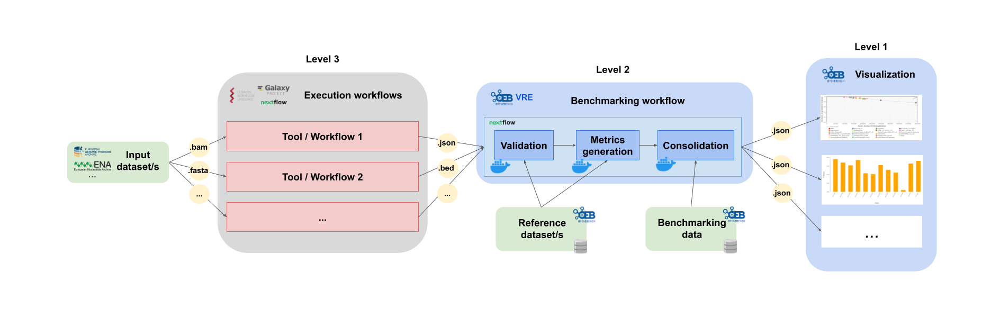

# Community-driven Scientific Benchmarking efforts

## Basic concepts

Unbiased and objective evaluations of bioinformatics resources are often challenging to set-up and can only be effective when built and implemented around community driven efforts. Several communities from different scientific domains collaborate with OpenEBench in order to set-up, host and further develop scientific efforts.

Communities are a group of people that face similar problems and want to collaborate in finding the best solutions and resources to face them. The communites are going to deinfe how the performance of the resource should be evaluated, which includes the definition of the metrics and reference datasets that they want to use for the benchmarking. Therefore, they are a key element in choosing or generating the reference data sets that are going to be used, which sometimes is not an easy task since they should reflect existing challenges of the scientific community in terms of size, complexity, and content. Also, the metrics that are used to measure the performance of individual participants should reflect the common practices in the field.

OpenEBench has engaged with different communities offering assistance to bring their data and activities into the platform. However, how communities use the platform depends on their specific needs and resources. To ensure the long-term sustainability of OpenEBench, a co-production model is implemented to accelerate the incorporation of new communities and the maintenance of the existing ones.

Communities can focus on specific problems, e.g. [Quest for Orthologs (QfO)](https://openebench.bsc.es/scientific/OEBC002); or having a broader spectrum e.g. Spanish Network of Biomedical Research Centers on Rare Diseases [(CIBERER)](https://openebench.bsc.es/scientific/OEBC004); or covering different challenges on each of their editions, e.g. DREAM Challenges. Benchmarking efforts led by scientific communities might have a national scope e.g. CIBERER; or a global one e.g., Global Microbial Identifier Initiative (GMI).

## Data flow and architecture levels

The benchmarking process starts in the execution of the tools or workflows with some input datasets in order to get the predictions that are going to be used for the benchmarking. This is what we call **level 3** and it is still not avaiable in OpenEBench and should be run by the members of the community previously. This can be done, for example, using Galaxy, nexflow or Common Workflow Language.

Once the predictions are avaiable, it is possible to run the benchmarking workflow which includes three steps: validation, metrics computation and results consolidation. During the validation, the input file format is checked and the content of the file is validated. Then, during the metrics computation, the predictions are compared with the reference datasets in order to evalaute the performance of each tool by different metrics. Finally, during the consolidation, the results of a particular tool are merged into the community's data. This step is performed in the [Virutal Research Environment (VRE)](https://openebench.bsc.es/vre//workspace/). This is what we call **level 2** and it allows the community to use benchmarking workflows to assess participants' performance.

The final of the bechmarking process is to make the results fo the performance of the tools avilable in the [OpenEBench webpage](https://openebench.bsc.es/dashboard). It is important that researchers can access these results at any time, and have the tools to assist them in understanding them. This is what we call **level 1** and it is used for the long-term storage of benchmarking events and challenges aiming at reproducibility and provenance.

### User roles

TODO
