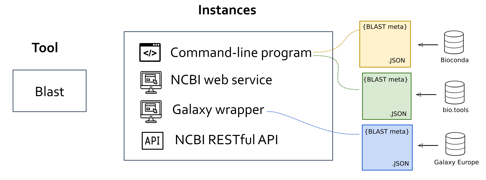

*********
Platforms
*********

OpenEBench ecosystem is composed by set of autonomous platforms and services well crosslinked to offer a integrated benchmaking platform. However, they well can be consumed independently, as they acomplish independent functionalities.

.. glossary::
       
  OpenEBench Web Portal
    https://openebench.bsc.es. The main landing page centralizing the access to all OpenEBench services and data. It integrates both, technical and scientific benchmarking platforms.

  
  Virtual Resarch Environment
    https://openebench.bsc.es/vre. The online workspace for organizing and participating to scientific benchmarking events and challenges.

  
  Tools Observatory
    https://observatory.openebench.bsc.es. The web portal that focuses on aggregated statistics of bioinformatics tools and services.

  
  Web Components
    A catalogue of web-based widgets to easely embbed OpenEBench benchmarking data and results into external web sites.  

Find below detailed information on each of these components:

.. toctree::
     :maxdepth: 4

     2_platform

=====================
OpenEBench Web Portal
=====================

The OpenEBench Web Portal is a web page where the final results of the benchmarking events are published. The data from the benchmarking event can come from different sources, depending on the community level of engagement:

       - The community has used the Virtual Research Environment to make the comparative evaluation and later on this data is published to OpenEBench.
       - The community has its own way to perform the comparative evaluation and wants to make the results public in a web page like OpenEBench.

.. list-table::
   :align: center
   :header-rows: 1

   * - OpenEBench Web Portal
   * - https://openebench.bsc.es

============================
Virtual Research Environment
============================

The OpenEBench Virtual Research Environment (VRE) enables the organization of OEB benchmarking events and the participation to them. The platform is a cloud-based computational e-infrastructure that triggers the execution of the :ref:`Benchmarking Workflows` associated to each event or challenge. The final outcome of the calculation is a set community-agreed assessment metrics that quantitatively and objectively evaluate the given participant's dataset.

.. list-table::
   :align: center
   :header-rows: 1

   * - OpenEBench Virtual Research Environment (VRE)
   * - https://openebench.bsc.es/vre

OpenEBench VRE offers a complete web interface that brings together public and/or consolidated benchmarking datasets, private participants' data, and the necessary mechanisms to import and execute benchmarking workflows on an reproducible and authomatic manner. In this way, the platform accomplishes different purposes to different users:

     -   For **scientific-community managers**, the workbench supports the composition, publication, management and monitoring of community's benchmarking workflows and challenges.
     -   For **participants**, the workbench supports the evaluation of their bioinformatics methods or pipelines against community-defined datasets and metrics by participating to registered OpenEBench benchmarking challenges.

.. tip:: 
     **Benchmarking Workflows** are docker-based pipelines prepared by the Benchmarking Event manager/s that compute performance metrics for a given participant's data, *i.e.*, the output produced by the bioinformatics method/pipeline being evaluated. See more at section :ref:`Benchmarking Workflows`.
     
     
Overall flow for Participants
-----------------------------

Software developers willing to participate to a OpenEBench Benchmarking Event are the end-users of the online workspace. They upload the results of their bioinformatic methods and commit them to registered benchmarking events to eventually obtain **evaluations on the scientific performance of their methods**.
The usual flow of a participant could be summarized in the following steps:

.. image:: ../media/image12.png
   :align: center

1. Upload to the platform the results of the method to be evaluated (*i.e.*, list of candidate genes, predicted 3D structures, modeled phylogenetic tree).
2. Select the relevant benchmarking event and "run it". Internally, the corresponding benchmarking workflow will compute the metrics qualifying the given data in a on-permisses cloud infrastructure.
3. Eventually, a graphic visualization is offered to comparatively analyse the obtained metrics with other participating method metrics.
4. If results are satisfactory, the benchmarking results can be publicated at the OEB portal or where the community stated. If not, they can also rerun the workflow with new data, and compare the results against themselves until they are satisfied with their performance.

**Relevant References:**

- **HOW TO:** :ref:`Participe to Benchmarking Events`

Overall flow for Benchmarking Event Managers
---------------------------------------------

OpenEBench scientific communities are represented by community managers, whose user account is granted with a set of privileges at the platform.
Community managers willing to organize a benchmarking event use the VRE to **publish and administrate benchmarking events**. Prior publication, managers require to define reference datasets and build the benchmarking workflow that implements the relevant metrics and challenges. Once the event is validated and publicly available, the platform helps monitoring participation, allowing participant assessment's submission and controlling the overall event life-cycle.

.. mermaid::
   :align: center
   graph TD
      A[Define datasets] --> C
      B[Define metrics] --> C
      C[Build benchmarking workflow] --> D
      D[Publish to OpenEBench VRE]

The overall steps to follow when preparing a new benchmarking event are very briefly summarized here:

1. Be granted a *community manager* role. Request it for one of the `enrolled communitites <https://openebench.bsc.es/scientific>`__ or lean how to :ref:`Become a new OEB community`.
2. Provide descriptive information on the new Benchmarking Event: enumerate challenges, define timeline, participation mode, prepare participant's instructions, etc.
3. Develop a full benchmarking workflow. It involves the materialization of a set of performance metrics as container-based Nextflow workflow and the definition of golden reference datasets.
4. Validate and publish the benchmarking workflow at the OpenEBench VRE. The process will enable the corresponding Benchmarking Event. 

**Relevant References:**

- **HOW TO:** :ref:`Organize benchmarking events`
- **CONCEPTS:** :ref:`Benchmarking Workflows`

=================
Tools Observatory
=================

The tools observatory aims to monitor the technical quality of research software in the Life Sciences. This is achieved through a comprehensive collection of metadata from different sources, which along with additional computational means, allows the automatic generation of metrics.

.. list-table::
   :widths: 200
   :align: center
   :header-rows: 1

   * - Tools Observatory
   * - https://observatory.openebench.bsc.es
    

Overview
--------

There are three main kinds of sections in the Tools Observatory: 

-  Metrics: review of software quality indicators from the FAIR perspective. 

-  Our data: a closer look at the data we are using in the "Metrics" section. 

-  Thematic: detailed analysis of different specific topics of interest. "Homepages" section, that analyses tools webpages domains and accessibility, belongs to this kind of sections.

General concepts:
-----------------

When it comes to tools, we manage three main concepts:

-  Tool: abstract notion of a given research software, as a
   computational solution that has been implemented and given an
   identity name by its author/s.

-  Instance: an specific materialization of a tool. Instancies of the
   same tool might vary in the way the users interact wiht it (e.g.
   command-line applications, web applications, libraires), availability
   (e.g. desktop and/or web applications) or differences in the code
   that are not big enough to justify considering them as distinct tools
   (e.g. different versions of the same software). All the metadata we
   extract from the various software registries and catalogues apply to
   instances and ot tools, since the latter are abstractions.

-  Entry: given an instance, the metadata extracted or generated from
   each data source.

