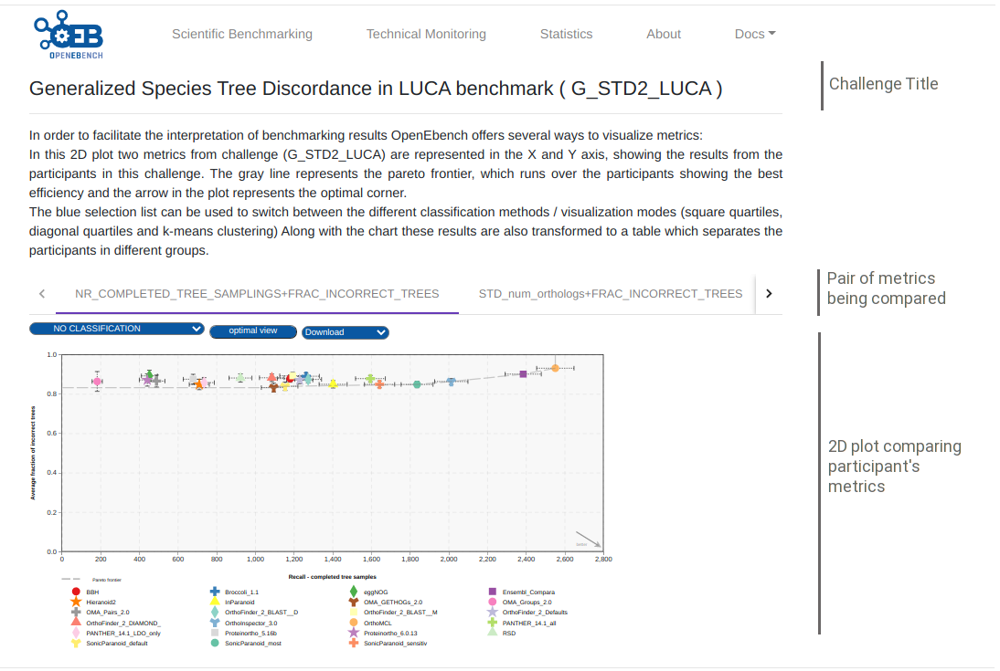
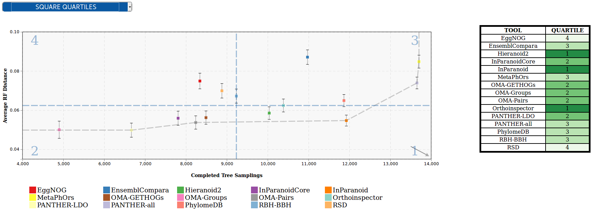
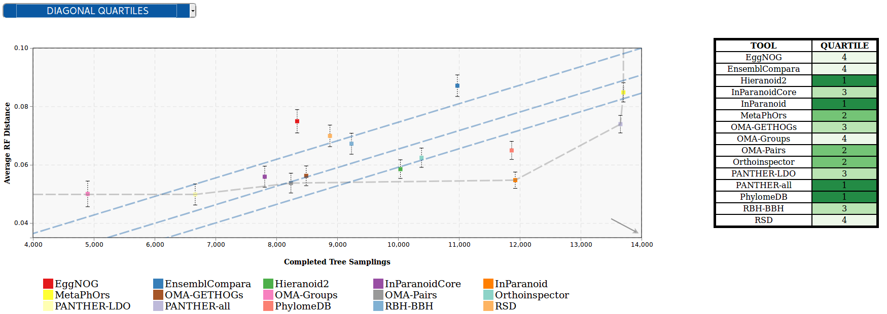
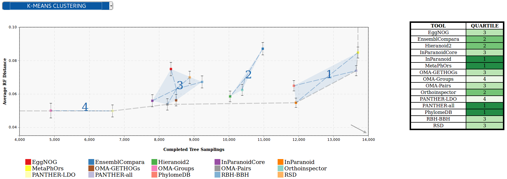
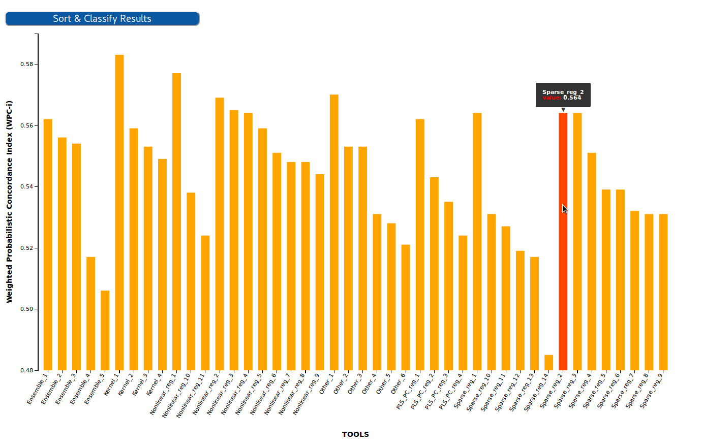
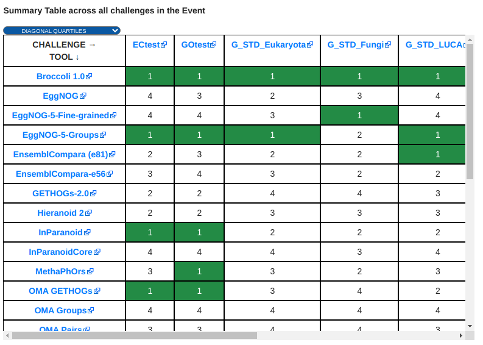

# Explore Benchmarking Results 

Browsing Online
---------------
If you want to explore the results of the tool you have evaluated or others, the easiest way is to do it through the [OpenEBench webpage](https://openebench.bsc.es/scientific). You can choose the community of your interest, browse among the list of benchmarking events and select it. A [summary table](1_explore_results.html#benchmarking-event-summary-table) is displayed. Selecting one of the challenges associated to the event, *i.e.*, each of the column's headers of the summary table, all the information related to that challenge will be displayed. A set of plots comparative classifying the assesment results of the participants to that challenge is displayed. 

## Visualization and interpretation

To compare the peformance of the evaluated resource, it is important to visualize the participants resuls in an appropiate context.  OEB offers a gallery of visualization methods that should be picked by the community according to the nature of their data and prospective users. Those visualization methods allow us to interpret and classify the benchmarking results so that they are easily understandable by all kinds of users. Currently, there are three available visualization modes in the platform, thant are descrived bellow.

### 2D ScatterPlot results visualization

This chart allows to visualize results from challenges that use two performance metrics (e.g precision vs recall), and apply several classification methods that transform them to tabular format, with a green color scale which makes it easier to find out which are the top-performing tools. These classification algorithms look for the optimization of the challenge metrics in order to group the tools according to their proximity to the 'ideal performance'.

1.  **Square quartiles** - divide the plotting area in four squares by getting the 2nd quartile of the X and Y metrics. This classification method basically splits the participants set in half by each of the metrics using the second quartile. By drawing a line over the quartile values in the plot, the area is divided in 4 groups that might not contain the same number of participants. These groups were then rated according to the performance of the participants within them; the square which overlaps with the 'optimal performance' corner is considered as the best group, followed by the one on its right/left, then the one over/under it, and finally the one in the opposite corner. However, this order may change according to the requirements of the supported community.

2.  **Diagonal quartiles** - divide the plotting area with diagonal lines by assigning a score to each participant based in the distance to the \'optimal performance\'. After normalizing the axes to the 0 - 1 range, the score is computed as the sum of the distances of each of the points to the axes; the higher that score is, the closer that participant is to the ideal performance. Linear quartiles classification was then applied to the scores dataset, obtaining three scores that group the participants in four classes - each of the groups is expected to have roughly the same number of participants. These groups were then rated according to the performance of the participants within them: the groups showing the highest score were considered as the first quartile (best performance).

3.  **Clustering** - group the participants using the K-means clustering algorithm, which groups data by trying to separate samples in n groups of equal variance, minimizing a criterion known as the inertia or within-cluster sum-of-squares. This algorithm requires the number of clusters to be specified, for consistency with the rest of the methods, it is by default set to four; however we could offer communities new visualization modes where the number of clusters can be customized. Once the algorithm converges, the groups are sorted according to the performance of the participants within them. In order to do that the clusters' centroids are considered as 'new' participants, representative of the full set of tools within a group and computed the score as we did in the diagonal quartiles method. That set of scores is then sorted to assign a ranking to each of the clusters. In order to visualize the different clusters in the plot the cluster number is shown next to each group, and a polygon is drawn grouping all the cluster' participants.

An interesting feature of this plot is the interactivity, the elements of chart's legend and table are clickable so that the end-user can hide the participants he is not interested in and/or lay far from the area of interest; and the classification is dynamically recomputed.

For more information, visit its [official Git Repository](https://github.com/inab/OpenEBench_scientific_visualizer)

### BarPlot results visualization

This chart allows to visualize results from challenges that use one single performance metric (e.g F-Measure), and transform them to tabular format, with a green color scale which makes it easier to find out which are the top-performing tools.

In this chart each of the bars corresponds to a participant in the challenge, while the Y-axis corresponds to the evaluation metric. The transformation to table is achieved by sorting the participant by the value of the metric in descending order, and then applying lineal quartiles classification to the metrics dataset, obtaining three scores that group the participants in four classes - each of the groups is expected to have roughly the same number of participants. These groups were then rated according to the performance of the participants within them: the groups showing the highest (or lowest, depending on the metric) values were considered as the first quartile (best performance).

For more information, visit its [official Git Repository](https://github.com/inab/Scientific_Barplot)

### Benchmarking Event Summary Table

The summary table condenses the results of a whole benchmarking event in a single table. Each of the columns corresponds to the quartiles/clusters of applying one of the classification methods described in the 2D ScatterPlot section, highlighted in green the top-performing tools. This view offers the possibility to see, at a glance, the overall results of a tool's performance across all the benchmarking challenges in a particular event.

For more information, visit its [official Git Repository](https://github.com/inab/bench_event_table)

OpenEBench API
-----------
There is also the possiblity to explore the results using the [API](https://openebench.bsc.es/sciapi/), where you can retrieve the information you need from the OpenEBench database.
