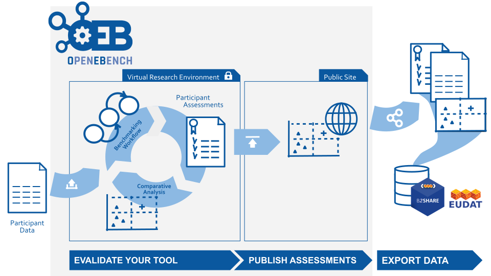

Participe to Benchmarking Events
--------------------------------

These guides will help you go through the different aspects rellevant for benchmarking the outcome of your tool as part of an open benchmarking event. The overall process is describing in this figure:

.. toctree::
   :maxdepth: 4
   
   participate/evaluate_tool
   participate/publish_oeb
   participate/publish_eudat
