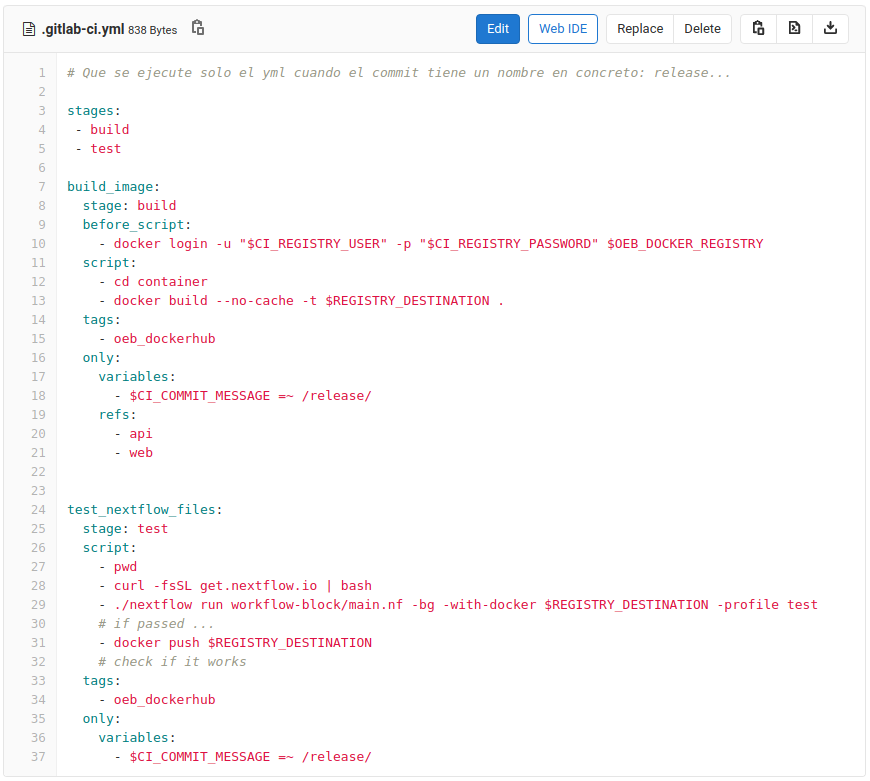

# Develop workflow blocks

The process consists on implementing a set of containers that compute the benchmarking metrics willing to be comparatively evaluated on the new benchmaking event. Indeed, it means to develop an OpenEBench benchmarking workflow. Learn more on the structure of the workflow [here](../../technical_references/4_benchmarking_workflows.md).

These benchmarking workflows are decomposite into different entities called «blocks» (subworkflows), so that the role of the community manager can combine and edit them individually. Those subworkflow pieces, blocks, need to recollect data on the following elements: main nextflow file, nextflow configuration file and the necessary VRE metada for the inputs and outputs files.

This data is in a GitLab repository from which the Git URL is provided.

### Git structure

If OpenEBench guidelines and good practices are followed, the workflow should be ready to be integrated at the platform in the frame of a certain benchmarking event for that community. In order to do that, the following steps need to be performed:

1.  Blocks are publically available in a Git repository, a URL and specific commit hash need to be provided. This Git URL can contain different folders or directly contain the information of the block. 

```{note}
Having different folders allows not having different repositories for each block.
```

If the repository contain folders it is necessary to be provided the name of the folder that contain the desired block. Otherwise, the section of "folder name" will be empty and it will be assumed that the information of the block will be in the root of the repository.

Also, the Git repository (or the folder in case of have it) has a specific structure:

```console
.
├── .gitlab-ci.yml
├── test-data
└── workflow-block
    ├── main.nf
    └── nextflow.config
```
The .gitlab-ci.yml has the following structure:



```{note}
Tags "oeb_dockerhub" is because of the [gitlab runner](https://docs.gitlab.com/runner/) can recognize the file. Also, the commit have to contain the word "release" to execute by himself.
```

It is necessary to configure some variables in Gitlab BSC to be capable of execute de gitlab-ci.yml:
   1.   **$CI_REGISTRY_USER**: INB/ELIXIR/OpenEBench/workflows/repository -> Settings -> CI/CD -> Variables
   2.   **$CI_REGISTRY_PASSWORD**: INB/ELIXIR/OpenEBench/workflows/repository -> Settings -> CI/CD -> Variables
   3.   **$REGISTRY_DESTINATION**: INB/ELIXIR/OpenEBench/workflows/repository -> Settings -> CI/CD -> Variables
   4.   **$CONTAINER_NAME**: INB/ELIXIR/OpenEBench/workflows/repository -> Settings -> CI/CD -> Variables
   5.   **$OEB_DOCKER_REGISTRY**: INB/ELIXIR/OpenEBench/workflows -> Settings -> CI/CD -> Variables

TO DO:

2.  Docker images have to be built in the VRE backend, which can be done by either providing OpenEBench team the required Dockerfiles, or uploading them as public containers to `Docker Hub <https://hub.docker.com/>`__.

3.  Create a new entry in VRE Tools database, specifying the workflow, reference data, inputs & output parameters to be used, and their associated VRE metadata.

4.  Make that entry available in the VRE interface as a new benchmarking workflow, so that software developers can test their methods at the workspace.

Also, it is highly recommended to fill in the `VRE Help <https://openebench.bsc.es/vre/help/tools.php>`__ section of the Tool/Workflow to inform users about how to test their methods (e.g. formats, parameters...).


