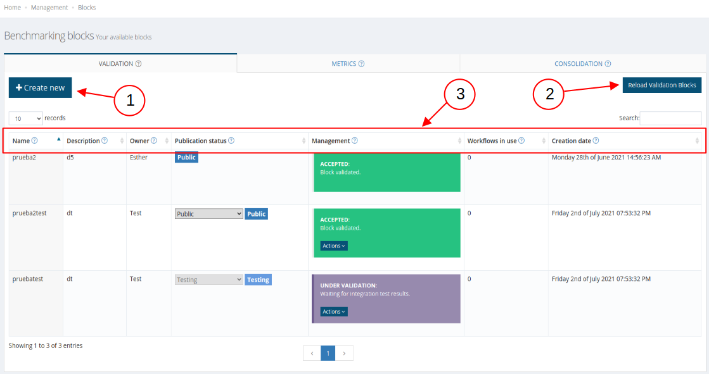
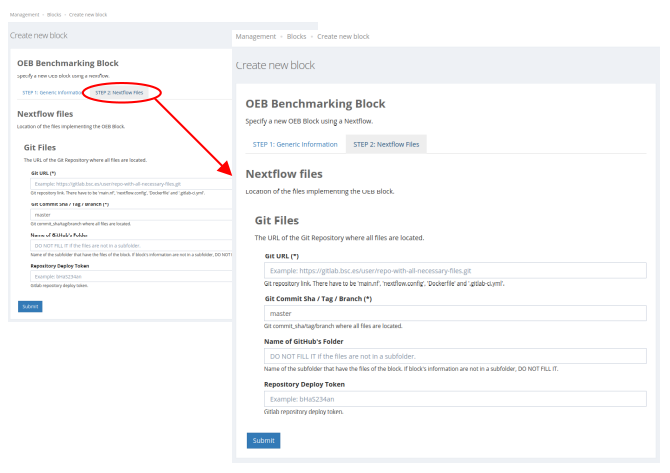

 
# Register a new workflow

The events of OpenEBench are composed of two big steps:

1.  Create three types of blocks: validation, metrics and consolidation. For each of these, the necessary information is requested, which is explained later.

2.  Create a new workflow with one block of each type. From this workflow the corresponding event will be created.

**Who can create this events?** 

OpenEBench VRE accomplishes different purposes to different users:
   1.   **Administrators**, who have access to all the platform.
   2.   **Tool developers**, who have the ability to create new events so that participants (common users) can participate in them.

### Blocks
    
   
   
   1.   **Create new**
        
        A form is opened to create a new block. In each section [validation, metrics and consolidation] there is a form corresponding to the type.
        
        

        -   **Git URL**: It is necesary to have all the required information to create the block in [GitHub](https://github.com/) or GitLab ([GitLab bsc](https://gitlab.bsc.es/) or [not](https://about.gitlab.com/)). 

            ```{note}
            The structure is explain in the section «Build metrics and workflows».
            ```

        -   **Git Branch**: Branch of the repository of Git URL that [OpenEBench VRE](https://openebench.bsc.es/vre/home/) have to clone.

        -   **GitHub's folder**: It is necessary a specific structure for the repository but this structure could be in a folder or not. If it is in a folder this section has to contain the name. If not the section is empty.

        -   **Repository Deploy Token**: TODO

   2.   **Reload block**

        The table can be reload with this button.

   3.   **Block properties**

        -   **Name**: All blocks have a required name.

        -   **Description**: All blocks have a required description to explain what they do.

        -   **Owner**: Names of the block owners. They are not the identifier.

        -   **Publication status**: This section indicates which users can use this block or not in a workflow and who can see the block in the table.
            -  **Public**: All the users have available the block to create a workflow. Administrators and owner can change the status. The rest of users only see tag "Public".

            -  **Private**: Only the owner and the administrators have available the block to create a workflow. Administrators and owner can change the status and see in the table. The rest of users do not have this block in their table.

            -  **Testing**: Any user have available the block to create a workflow. Administrators and owner can change the status and see in the table. The rest of users do not have this block in their table.

            -  **Community available**: The owner, the administrators and the users that belong to the selected community have available the block to create a workflow. Administrators and owner can change the status and see in the table. The rest of users only see tag "Community available".

            ```{note}
            The publication status cannot be change if it affects any user in workflows availability. For example, if the block is available to one user of a specific community and the publication change to private but he is not the owner and not administrator that will not be possible.
            ```

        -   **Management**: This section indicates the status of a block [accepted, rejected or under valitarion]. Also there are a button "Action" that deppending the user and the status of management do one thing or anothers.

            1. **Actions**:
                -  **Accept block**: The administrator accept a block that is «under validation». The new status of this block will be «accepted».
                -  **Modify block**: The block can be modify. After that modification will be passed all the necessary validations. If the Git URL is from BSC, the validation will be automatic and the new status will be «accepted» or «rejected». If the Git URL is not from BSC, the status will be «under validation».
                -  **Delete block**: The block is erased from the table if it is not being used in a workflow.

            2. **Status**:
                -  **Accepted (Registered internally)**: The block is available to form a workflow.
                -  **Rejected**: The block it is **not** available to form a workflow.
                -  **Under validation**: The validation block is pending. This one is carried out by the administrator, except if the Git URL is from BSC GitLab, that the validation is automatic.

            **Relation between status, actions and type of users**:
                - **Registered**: 
                    - **Administrators**: «Delete block» (if it is not being used in a workflow).
                    - **Tool developers**: «Delete block» (if it is not being used in a workflow).
                - **Rejected**:
                    - **Administrators**: «Delete block» and «Modify block». If it is modify, check all the validation (and change the status or not).
                    - **Tool developers**: «Delete block» and «Modify block». If it is modify, check all the validation (and change the status or not).
                - **Under validation**:
                    - **Administrators**: «Accept block», «Delete block» and «Modify block». If it is modify, check all the validation (and change the status or not). If it is accepted, the status of block change to «registered».
                    - **Tool developers**: «Delete block» and «Modify block». If is it modify, check all the validation (and change the status or not).
        
        -   **Workflows in use**: Number of workflows that are using the corresponding blocks.

        -   **Creation date**: Dates that were created the blocks.

### Workflows

TO DO
