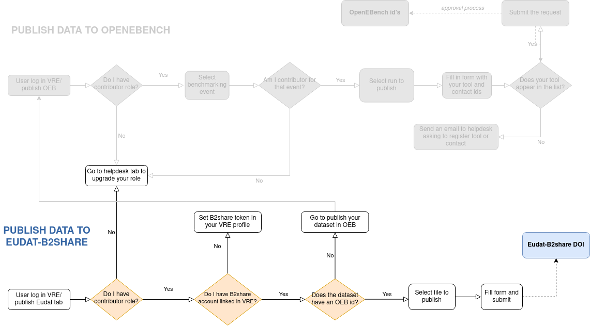
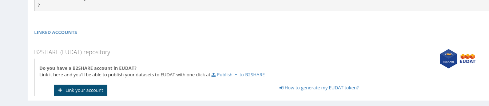
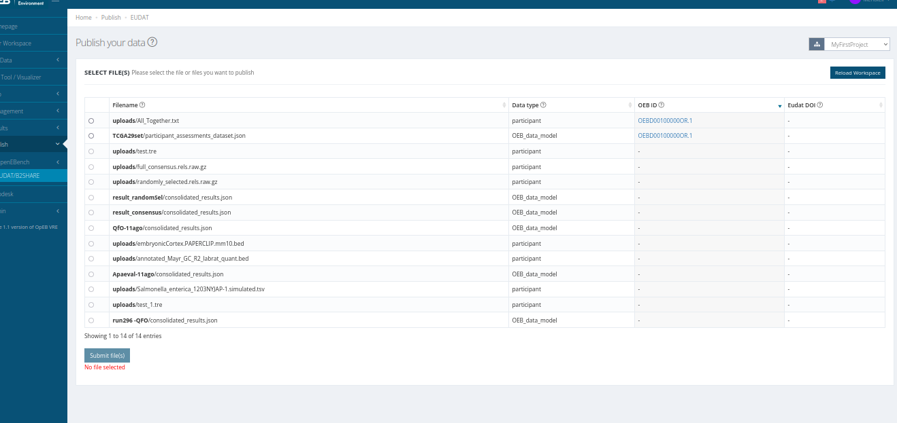
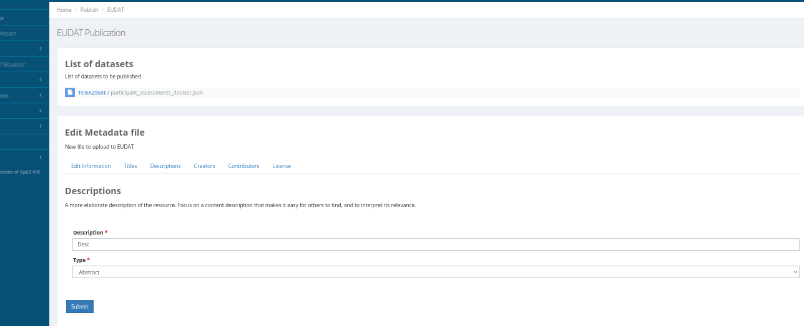

##########################
Publish your data to EUDAT
##########################

EUDAT is an European project to develop a Collaborative Data Infrastructure (CDI) which provides means for managing large distributed collection of digital objects, maintaining metadata and applying data management policies. 

B2SHARE is the EUDAT user-friendly, reliable and trustworthy service for researchers, scientific communities and citizen scientists to store and publish research data from diverse contexts. More information: `EUDAT-B2SHARE <https://eudat.eu/services/b2share>`_.

Using the Virtual Research Environment
######################################

OpenEBench offers a Graphical User Interface to upload benchmarking data to B2SHARE remote repository. 
B2SHARE is distributed in communities. OpenEBench has its own community there. Using the Virtual Reaserach Enviroment to upload data in B2SHARE, it will be push it in the OpenEBench community (`OpenEBench community <https://b2share.eudat.eu/communities/OpenEBench#>`_).

What benchmkarking data can be published?
=========================================
- Participant dataset
- Participant Assessments dataset
- Aggregation dataset (once benchmarking event is closed, done by event manager)

Prerequisites
=============
In order to publish your data in EUDAT OpenEBench community, it is necessary to link your Eudat account in Virtual Research Enviroment:  

First you need to register in EUDAT and generate an access token. (`Generate Eudat token <https://eudat.eu/services/userdoc/b2share-http-rest-api#Creating_an_access_token>`_). Afterwards, you can easily link your Eudat account in VRE, going to your profile / keys tab.

Introduce your access token and your email used to register in Eudat. Your account will be successfully linked. 

Why should I publish data to B2SHARE?
=====================================
Data in OpenEBench is not long persistent. B2SHARE  Integrated with the EUDAT collaborative data infrastructure, B2SHARE offers a solution to store and preserve your data. Data in B2SHARE is assigned a persistent identifier, which can be retraced to the data owner. Also your data will be uploaded in B2SHARE OpenEbench community with all community-specific metadata automatically filled. 
Definitely is an easy and useful way to long-store and publish your data for use by scientific communities.

You can find more features on B2SHARE web page:  `What_is_B2SHARE <https://eudat.eu/services/userdoc/b2share#What_is_B2SHARE>`_.

Who is allowed to do?
=====================
- Benchmarking event contributors
- Managers events

.. note:: Check your asigned role: `Account details <https://openebench.readthedocs.io/en/latest/how_to/users_accounts.html#user-role-and-community>`_.

How do I publish data to B2SHARE from Virtual Research Environment?
===================================================================

Select your datasets to publish

Fill the metadata form and confirm the dialog.

Your data has been successfully published to EUDAT.

.. image:: https://user-images.githubusercontent.com/63742994/114579564-44dbcd00-9c7e-11eb-8057-c47b63d247b7.png
