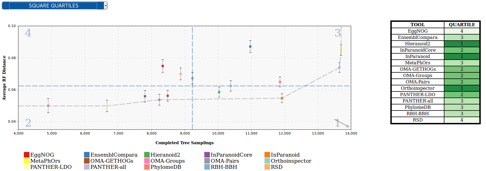

###############################
Publish your data to OpenEBench
###############################

OpenEBench community managers and participants can upload the results of their benchmarking events to find them publicly available at the OpenEBench portal. The publication process is available online through the Virtual Research Environment, upon the organizator's event approval. Community managers can also push the data in a programmatic way using the corresponding REST API. Find more details below.

Using the Research Environment
##############################

As seen in the Figure below, user execute the benchmarking workflow in the Virtual Research Enviroment. All user files, input and outputs datasets of the workflow are private for user. 
Then user can decide if they want to publish the datasets to OpenEBench. Only afterwards, the possiblity to publish the datasets to remote repository EUDAT will be allowed.

.. _RST Data_to_be_published:
What benchmkarking data can be published?
=========================================
To publish data to OpenEBench portal, two types of datasets are allowed:

- **Participant dataset**: Produced by participants with their tool from a specific input data.
- **Participant Assessments dataset**: It includes participant data and assessment data. Generated once a benchmarking worflow has been successfully executed.

.. Note::
    For more details, see the `Scientific datasets <https://openebench.readthedocs.io/en/latest/technical_references/2_scientific_datasets.html#datasets-types-and-cross-references>`_ reference.

In order to publish in OpenEBench, these datasets must belong to an active benchmaking event, it means that a benchmarking workflow in VRE must have been executed. More info: `Evaluate your tool <https://openebench.readthedocs.io/en/latest/how_to/participate/evaluate_tool.html>`_.

As the process to publish includes to associate the data to a registered OpenEBench tool, participant tool must be registered in OpenEBench first in order to asign an OpenEBench id for the participant tool. More info: `Register your tool <https://openebench.readthedocs.io/en/latest/how_to/participate/register_tool.html>`_.

Why should I publish data to OpenEBench?
========================================
As metion before, OpenEBench is the benchmarking and technical monitoring platform for bioinformatics tools, web servers and workflows. Publishing data from the  benchmarking workflows implies:

- Data will become publicly available on the OpenEBench data portal.
- Data will receive a unique OpenEBench identifier. This allow user to afterwards refrencee that data in publications or publish it to a remote repository, B2SHARE. More info: `Register your tool <https://openebench.readthedocs.io/en/latest/how_to/participate/publish_eudat.html>`_.
- Data will be stored on the internal OpenEBecnh datastore (not persistent)

Who is allowed to do?
=====================
Any user with a minimum role contributor can request to publish their files in OpenEBench. 

To request an upgrade role, please see the section: `Request a role upgrade <https://openebench.readthedocs.io/en/latest/how_to/5_users_accounts.html#request-a-role-upgrade>`_.

How do I publish data to OpenEBench?
====================================
Log into the `Virtual Research Environment (VRE) <http://openebench.bsc.es/vre>`_ and go to **Publish/OEB/New Request** tab:

.. Note::
    More info: `Virtual Research Enviroment <https://openebench.readthedocs.io/en/latest/concepts/3_platform.html>`_.
    

It appears the list of files available to publish from user workspace. Select which file/s to publish.

                

Complete the form with the information of each dataset. You will be asked for your tool used to compute the participant data. It has to be registered in OpenEBench. Also any contact to introduce have to be in OpenEBench.

A summary of the form is showed. Click submit to request to publish these data. Message with successfully request should appear. 

Once the request is sent, you can follow and manage it in **Publish/OEB/Manage Request**. In actions column, you can cancel it.
The request can be cancelled only when it is in pending approval status. 

Once approved, the data will be publicly available in the `OpenEBench <http://openebench.bsc.es>`_.

Administration: How to manage user publication requests?
========================================================
Benchmarking event managers receive users petitions to publish their data results to benchmarking events. 
Notifications and emails are sent to alert manager that new requests are pending to be approved. 
To approve/deny these requests, managers should go to "Manage requests" on their Virtual Research Enviroment and a second table with all requests received is displayed. They can download participants datasets, see their results and manage the request from there.

\
\
\

Using the REST API
##################

OpenEBench Community Managers can upload the results from their full benchmarking event to the platform by using one of the scientific APIs 
(https://openebench.bsc.es/api/scientific/submission/) . In order to do that they have to:

1.  Covert their full experiment to the official `Benchmarking Data Model <https://openebench.readthedocs.io/en/latest/technical_references/1_scientific_data_model.html>`_ - datasets, tools, challenges... Please contact the OpenEBench team if you need any help in adapting your benchmarking process to the data model concepts.

2.  Validate the full set of generated JSON objects against the official `Benchmarking Data Model <https://openebench.readthedocs.io/en/latest/technical_references/1_scientific_data_model.html>`_  using this `JSON Schema validator <https://github.com/inab/extended-json-schema-validators>`_.

3.  Register the community and manager contact (if not already done) - now this is done by OEB managers with the community and main contact objects. New managers will be assigned an username and password.

4.  Merge the set of JSON objects into a single array. In Linux systems, executing the following command in the root directory that contains all files does the trick : `jq -s . $(find . -type f -name "*.json") > your_file_name.json` (jq library needs to be installed).

5.  Upload the array of JSON objects to the temporary database (using the assigned username and password) with the following command : `curl -v -X POST -u <user>:<passwd> -H "Content-Type: application/json" https://dev-openebench.bsc.es/api/scientific/submission/?community_id=OEBC002 -d @your_file_name.json`

6.  Send an email to openebench-support@bsc.es containing the name of the JSON objects uploaded to the temporary database.

7.  Wait until the OpenEBench team moves the data to production OpenEBench Mongo DB.

8.  Data is ready to be visualized in `OpenEBench <https://openebench.bsc.es/>`_.

.. image:: ../../media/image8.png
