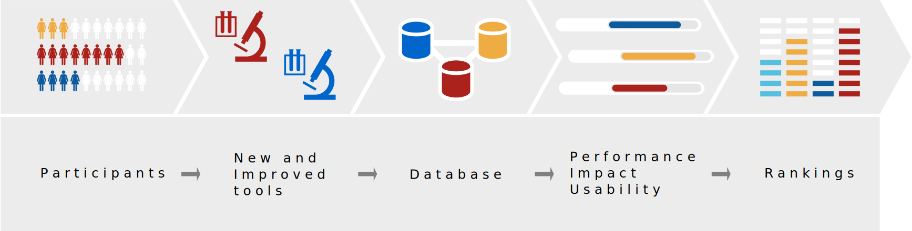

# Overview

OpenEBench is an infrastructure designed to establish a benchmarking system for bioinformatics methods, tools and web services. It is part of the ELIXIR Tools platform and its development is led by the Barcelona Supercomputing Center (BSC) in collaboration with partners within ELIXIR and beyond.

OpenEBench is being developed so as to cater for the needs of the bioinformatics community, especially software developers who need an objective and quantitative way to inform their decisions as well as the larger community of end-users, in their search for unbiased and up-to-date evaluation of bioinformatics methods. The goals of OpenEBench are to:

* Provide guidance and software infrastructure for Benchmarking and Techincal monitoring of bioinformatics tools.
* Engage with existing benchmark initiatives making different communities aware of the platform.
* Maintain a data warehouse infrastructure to keep record of Benchmarking initiatives.
* Expose benchmarking and technical monitoring results to Elixir Tools registry.
* Establish and refine communication protocols with communities and/or infrastructure projects willing to have a unified benchmark infrastructure Coordinate with Elixir.
* Interoperability Platform to keep FAIR data principles on Benchmarking data warehouse.

In OpenEBench you will be able to find three types of activities:

* Scentific Benchmarking
* Assessment of Research Software quality
* Software Observatory

## Community-driven Scientific Benchmarking efforts

Scientific benchmarking helps determine the precision, recall and other metrics of bioinformatics resources in unbiased scenarios, which have been set up through reference databases, ad-hoc input and test data sets reflecting specifying scientific challenges. Chosen metrics allow us to objectively evaluate the relative scientific performance of the different participating resources. Communities are the cornerstone of the benchmarking effort in OpenEBench because they are the domain experts with the necessary expertise to identify, define and select the data sets deemed as the ground truth for the benchmarking and the quantitative metrics that best determine the performance of the evaluated tools.

Scientific communities in OpenEBench provide a way for software developers to implement more efficient methods, tools and web services by doing scientific benchmarking, which compares their performance on previously agreed data sets and metrics with other similar resources. In addition, it helps individual researchers that tend to have difficulties in choosing the right tool for the problem at hand, and are not necessarily aware of the latest developments in each of the fields of the bioinformatics methods they need to use.

## Assessment of Research Software quality

Software quality is a key issue in research, as the quality of scientific outcomes is clearly interconnected with the quality of the tools used to deliver them. Bioinformatics as a whole has been largely accused of generating poor research software due to the prioritization of the quick results over the optimization and standardization of the tools used. This is not unexpected, as bioinformatics is a fast evolving field. Accepted algorithms become obsolete far before the software made out of them can reach the usual quality standards normal in other disciplines. While this is traditionally accepted as normal use by researchers, it puts strong questions in the reproducibility of research results and on the validity of processed data deposited in large archives like, for instance, the European Genome-Phenome Archive. OpenEBench, as indicated above, holds a [specific infrastructure to monitor software quality](https://openebench.bsc.es/tool?search=).

## Software Observatory of Quality Research Software

Research software tend to evolve over time as response of continuous innovation. Innovation can be of technological nature, e.g. more powerful computational resources, or of scientific nature, e.g. development of new algorithms, emergence of new data types. Thus, it is important to capture those changes over time into a reference place where communities can easily access to it. Research software observatories have been conceived as those places where a given community can bring together their relevant resources, particularly software. Software observatories should then ensure that all changes produced in the software are pertinently captured to provide an up-to-date view of the activities in a particular scientific domain. Those efforts would be ideally complemented with relevant resources to the community. Resources can include reference data sets for conducting technical and scientific benchmarking, either individually and as a part of community-agreed assessments, as well as software development best practices, training materials, among others.
