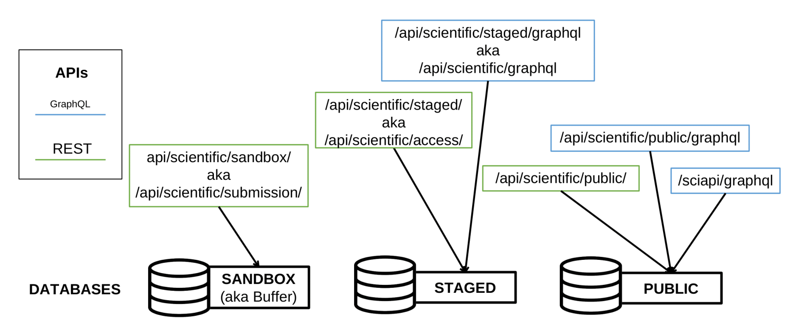

# OpenEBench APIs

OpenEBench platform aims to be a central platform not only to generate,
but to publish and distribute benchmarking data across the scientific
community. To this end, a set of microservices are publicly offered as
REST APIs to retrieve data from the major OpenEBench repositories.

| Data Retrieval APIs           |                     URL                                | Source code | 
|-------------------------------|--------------------------------------------------------|-------------|
| OpenEBench Tools Monitoring   | [endpoint](https://openebench.bsc.es/monitor/)         | [https://gitlab.bsc.es/inb/elixir/tools-platform/elixibilitas](https://gitlab.bsc.es/inb/elixir/tools-platform/elixibilitas)        | 
| OpenEBench Scientific REST API | [endpoint](https://openebench.bsc.es/api/scientific/) | [https://gitlab.bsc.es/inb/elixir/openebench/openebench-rest-api](https://gitlab.bsc.es/inb/elixir/openebench/openebench-rest-api)     | 
| OpenEBench Scientific Retrieve|  [endpoint](https://openebench.bsc.es/sciapi/ )        | Inab repo        | 

Those API's access OpenEBench MongoDBs instances (v4.2.5) and allow
users to query for the results they are interested in. Access to
OpenEBench is generally authenticated (although anonymous users can be
created). In those conditions data and tools access can be restricted as
required. OpenEBench will not provide data access credentials. Instead,
we will honor the agreements between data users and providers.

Information from these APIs is obtained in JSON format (see partial example on figure  below). 

It is relevant to note that information can be obtained for specific versions or specific deployments of the tool. This opens the possibility of performing historical analysis comparing the performance and/or availability of different resources versions. More information on  the API is available at https://gitlab.bsc.es/inb/elixir/tools-platform/elixibilitas.
