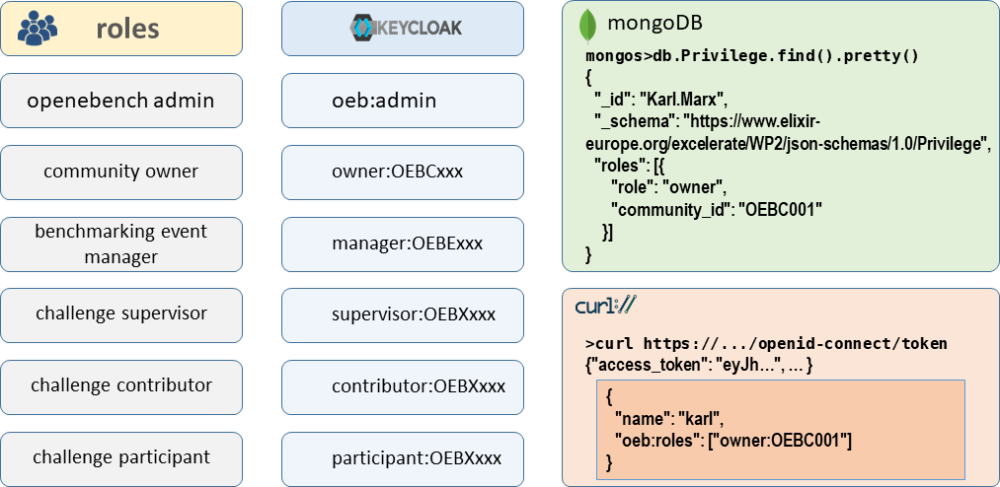
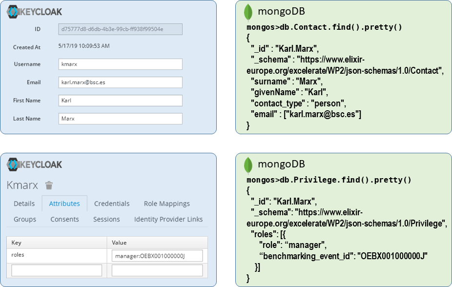

# Authentication and Authorization

## Introduction

OpenEBench authentication and authorization are based on the OpenID Connect 1.0 protocol. The project uses "openebench" realm configuration 
of the INB [Keycloak](keycloak.org) server.  
Each OpenEBench client must be configured according supposed OpenID flows.   
OpenID clients may differ in their configuration, but provided by keycloak configuration endpoint should be enough: [.well-known/openid-configuration](https://inb.bsc.es/auth/realms/openebench/.well-known/openid-configuration)

## Roles

OpenEBench security is based on the concept of **roles**. Roles go with a set of permissions that allow to perform operations associated with the role.  
OpenEBench defines several roles that tightly connected with OpenEBench data model:

* Community Owner (owner): person responsible for the entire benchmarking community.
* Benchmarking Event Manager (manager): person responsible for the particular benchmarking event.
* Challenge Supervisor (supervisor): person that supervises challenge contributors and participants.
* Challenge Contributor (contributor): person that contributes to the benchmarking challenge.
* Challenge Participant (participant): participant of the benchmarking challenge.

OpenEBench Authentication/Authorization is based on the OpenID Connect 1.0 protocol. The roles are included in tokens as "oeb:roles" claim.

## Keycloak Roles

In the Keycloak Server OpenEBench roles are modelled as user attributes:

